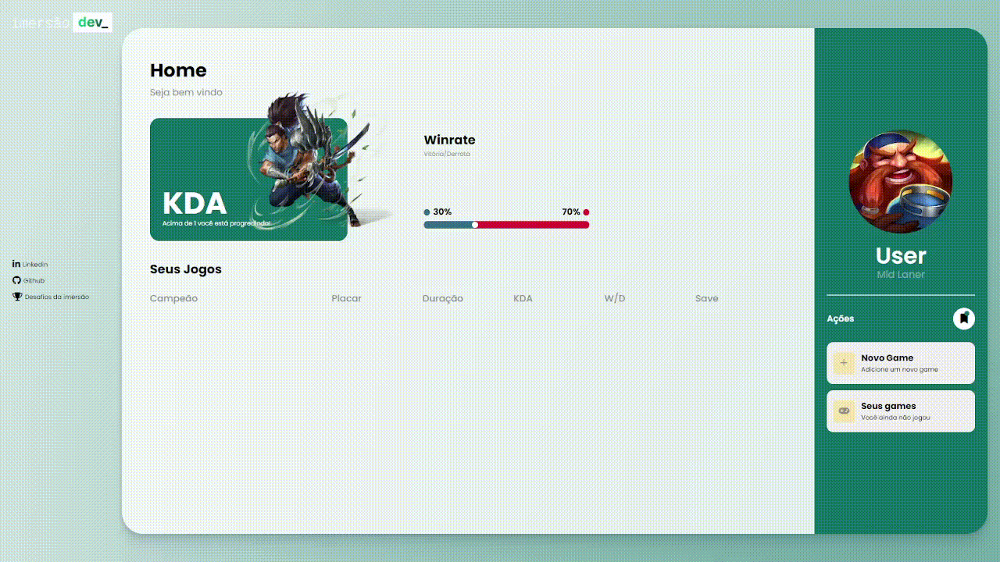

<h1 align="center"> Desafio Final | Imersão dev </h1>

# Diário de bordo 

| DIA | HORAS|
|---|---|
| 15/02 | 2h 44m | 
| 17/02 | 2h 16m | 
| 18/02 | 2h | 

## Tempo codando cada arquivo wakatime

| HTML | SASS | JavaScript| Figma |
|---|---|---|---|
| 1h | 3h | 1h | 2h 

# Projeto

Um desafio elaborado com todos os conhecimentos adquiridos na imersão dev

# Link

> <https://gustav0dedeus.github.io/Challenger/>

# Linguagens

* <h2>HTML</h2>
* <h2>SASS</h2>
* <h2>JS</h2>
